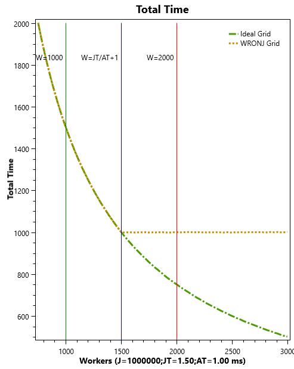
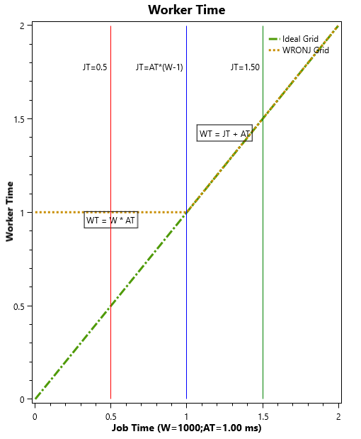
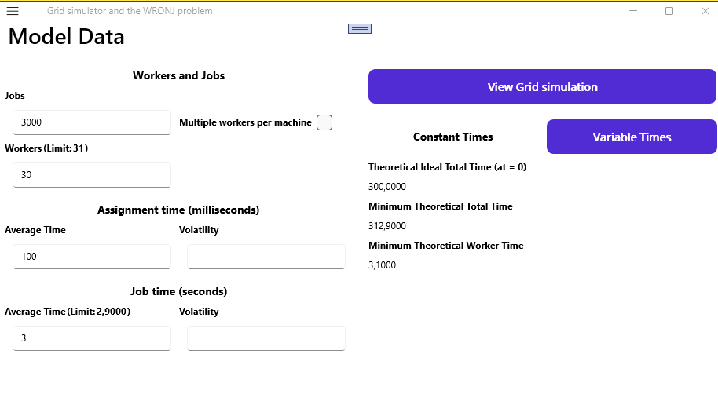
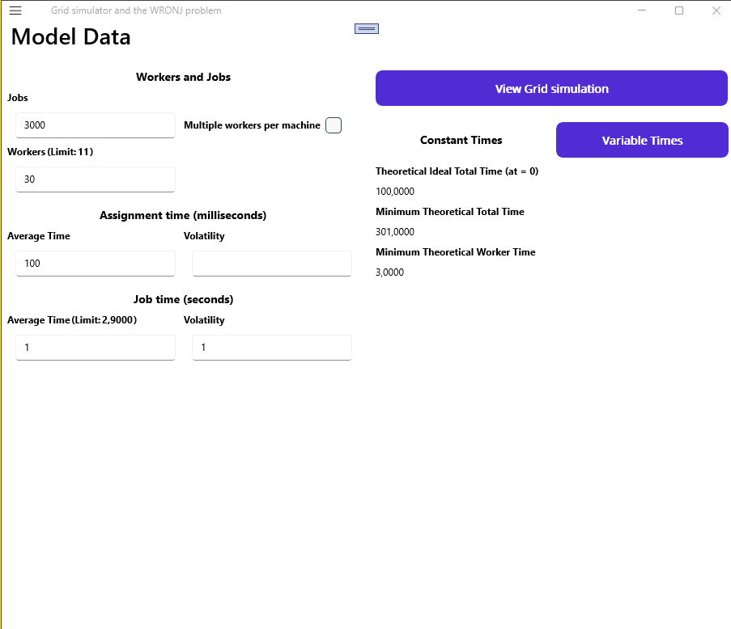
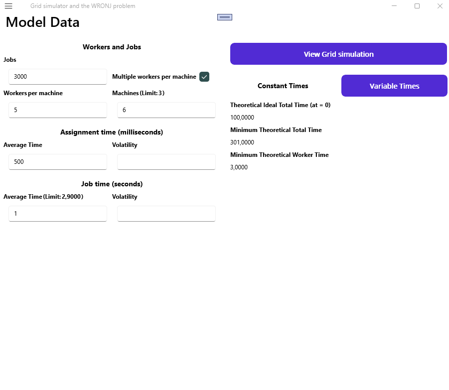
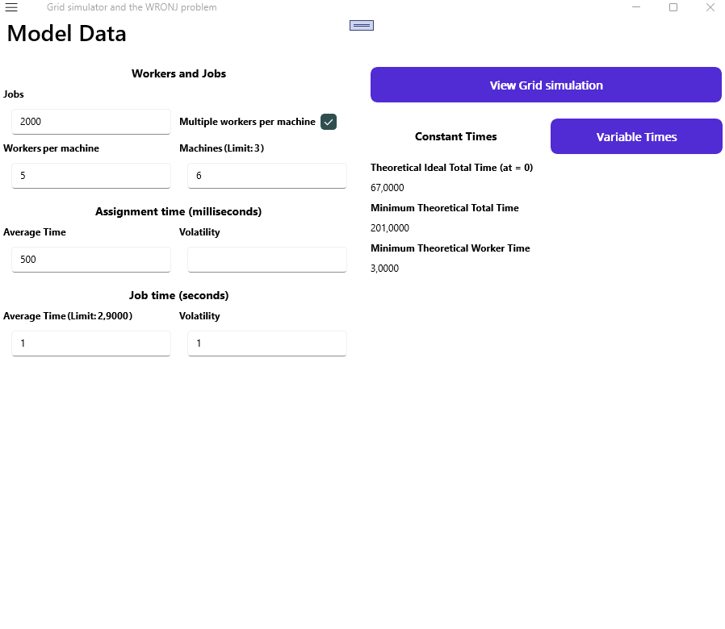

# Grid simulator and the WRONJ problem

When we are computing a workload in a grid where the [job scheduler](https://en.wikipedia.org/wiki/Job_scheduler) that assigns the workload jobs to idle workers runs in a fixed number of threads of execution, a performance slowdown can occur that we call the **WRONJ (Workers Resting On Next Job)** problem. 

This document is a description of this phenomenon for the simplest grid architecture, where the scheduler runs on a single thread, and the jobs are assigned to a worker individually, but it applies to any other grid where the number of schedule instances don't scale with the number of worker instances: the problem occurs when the job scheduler is a bottleneck because the queue of assignation tasks becomes a [critical path](https://en.wikipedia.org/wiki/Critical_path_method) of the process.

Also, this document is the help guide of the grid simulator application that we will use to illustrate the problem.

***WRONJ*** is a generic scheduling problem and usually goes unnoticed, but may be a big issue in the context of high throughput [grid computing](https://en.wikipedia.org/wiki/Grid_computing) when a grid has a large number of workers processes and the grid is full (i.e. the number of jobs to be done is greater than the number of grid workers).

In these cases, we may want to reduce the workload total time and improve the grid performance by increasing the number of workers, but that's when the problem can arise. If the number of workers reaches a certain limit the grid just doesn't scale: the total time will be the same from that limit on. In our simple grid, this limit is ***JT/AT  + 1***, where ***JT*** is the  average time for workload jobs and ***AT*** is the average time it takes for the scheduler to assign a new job from the job queue to an idle worker.

It's basically a [parallel slowdown](https://en.wikipedia.org/wiki/Parallel_slowdown) affecting a kind of workloads where these slowdowns are not supposed to happen on an ideal grid, but can actually appears when we hit some thresold values on a wrongly implemented grid.

 # Contents
- [Grid simulator and the WRONJ problem](#grid-simulator-and-the-wronj-problem)
- [Contents](#contents)
- [Grid description](#grid-description)
- [The WRONJ Limit](#the-wronj-limit)
- [Ideal grid vs WRONJ grid](#ideal-grid-vs-wronj-grid)
- [Possible solutions to the WRONJ problem](#possible-solutions-to-the-wronj-problem)
- [The WRONJ app](#the-wronj-app)

# Grid description

 1. We have a grid with a number ***J*** of jobs and a number ***W*** of worker processes (workers), all with the same computing power: they take the same time to compute the same job.
 1. The grid has a queue to manage all the pending jobs to compute using a [FCFS](https://en.wikipedia.org/wiki/Scheduling_(computing)#First_come,_first_served) scheduling algorithm. This is the ***JQ*** (Job Queue).
 1. The grid uses another queue to manage the idle workers, the ***IWQ*** (Idle Workers Queue). When a worker has finished its job, the grid add a reference of that worker to the end of the ***IWQ***.
 1. The ***JS*** (Job Scheduler) of the grid is a single-threaded process, that chooses the next job to execute from the ***JQ*** and assigns it to the first idle worker in the ***IWQ***. 
 1. The ***at*** (assignment time) is the time it takes for the ***JS***  to complete that assignation (this will be mostly the time it takes to send the job data to the worker, probably over a network).
 1. The ***AT*** (Assignment Time) is the average of all ***at*** in the workload.
 1. The ***jt*** (job time) is the time between when a worker starts to compute a job (once it's assigned to it) and when it notifies its completion by placing itself in the ***IWQ*** (this will be mostly the job computation time, plus the time is takes the notification).
 1. ***JT*** (Job Time): average of all ***jt*** in the workload. 
 1. ***iwqt*** (idle worker queue time): time that the worker has been idle, waiting in the ***IWQ*** since it has finished a job until the ***JS*** assigned it the next job. Its minimum value is ***at***.
 1. ***IWQT*** (Idle Worker Queue  Time): average of all ***iwqt*** in the workload. Its minimum value is ***AT***.
 3. ***wt*** (worker time): time it takes a worker to process a job, since it started to compute until it starts the next one. It's ***wt = jt + iwqt***, so its minimum value is ***jt*** + ***at***.
 4. ***WT*** (Worker Time): average of all ***wt*** in the workload. ***WT = JT + IWQT*** and its minimum value is ***JT*** + ***AT***.
 5. We'll say that a grid is a full grid when ***J*** > ***W***. An stressed grid is a full grid when ***J*** >> ***W***
 6. ***TT*** (Total Time): is the time it takes the grid to process all the jobs in the workload. When the grid is full, this time will be ***&#x2243; J*** * ***WT / W***.
 
  
In our application we can set a grid with the input parameters (***J***, ***W***, ***AT***, ***JT***) and calculate the output ones (***WT***, ***TT***), and can also show a grid simulation like this one: 

 
The simulation use a different icon for each job, and a different color for each worker (ranging from red to blue). In the image above, we can see seven active workers computing different jobs, three idle workers waiting for a new job and the first first worker in the ***IWQ*** (the orange one) about to be assigned by the ***JS*** the next job in the ***JQ***. When the assignment is done, the orange one is now an active worker and it starts the assignment of the new worker in the ***IWQ***:

The **WRONJ** problem occurs when there are always idle workers waiting in ***IWQ***, preventing the grid from using 100% of its capacity. This will happen under the conditions we desdribe in the following paragraph.

# The WRONJ Limit
 
The total time of a workload with just one worker will be:

*TT = jt1 + at1 + jt2 + at2 + .... + jtJ + atJ = J * (JT + AT)*

If we have ***W*** workers in a stressed grid where we can disregard grid fill time, the expected total time would be:

1) *TT = J * (JT + AT) / W*

On the other hand, regardless of the number of workers, the ***JS*** wil take at least the sum of assignation times to complete the workload:

2) *at1 + at2 + .... + atJ = J * AT*

The WRONJ problem will appear when the second time becomes a critical path of the workload, that is, when time 2 is greater than time 1. The limit is when 1 and 2 are equal:

  *J * (JT + AT) / W = J * AT* 

And from that expression we get the expression for the limit number of workers: we will call this expression the ***WRONJ Limit (WL)***: 

3) ***W = JT / AT + 1***

# Ideal grid vs WRONJ grid

An ideal grid is one where ***at = 0***: all workers are always active when the grid is stressed. In such a grid, the equality ***WT = JT*** holds, and the total time of a workload will be ***&#x2243; J * JT / W***.

A **WRONJ** grid is one with ***at > 0*** that meets the [description](#grid-description) and [conditions](#⟶) above.

In an ideal grid, we can reduce the total time just increasing the number of workers, but as we saw before, that doesn't work in a **WRONJ** grid once we reach a determined number of workers: up to that number, as in the ideal grid, the time will reduce inversily with the workers, but once we reach a determined thresold (the time of the critical path of the sum assignation times), the total time remains constant regardless the number of workers.

The next chart shows the scalability problem with **WRONJ** grids using an example with realistic parameters. The workload has a million jobs where ***JT*** is a second and a half, the ***AT*** in the **WRONJ** grid is one millisecond, and we are increasing the number of workers (we stand out some number around the limit: 1000, 1500, 2000). In this case the grid is stressed, so in the ideal grid, the total time is inversely proportional to ***W***. But in the **WRONJ** grid, once we reach the limit value of 1501 workers (***= JT / AT + 1***), the total time remains at the fixed value of 1000 seconds (***= J * AT***):

 If we are computing a [perfectly parallel](https://en.wikipedia.org/wiki/Embarrassingly_parallel) workload where we can split the tasks as we wish without penalty, we can then create equivalent workloads that perform the same tasks but using a differente number of jobs with different job times: for instance, if we can split each job in two jobs, we'll have twice the number of jobs, with half the job time.

In these cases, we can focus in the ***JT*** parameter instead of the number of workers. We can write the **WL expression** as this:

4) ***JT = (W - 1) * AT***

When *JT > (W - 1) * AT* the grid will behave as an ideal grid, and the worker times have their optimum value of *WT = JT + AT*. In the limit point of expression 4, this will be  *WT = W *
AT*. But in this point we reach the critical path of times asignations, so bellow this point the total time (and therefore, the worker times) remains fixed and so ***WT = W * AT***, no matter how decrease the job times.

The next chart shows ***WT*** as a function of ***JT***, in an ideal grid and in a **WRONJ** grid, both with 1000 workers. The ***AT*** value in the **WRONJ** grid is one millisecond. If ***JT*** is 1.5 seconds or is equal to 0.999 seconds (i.e. the limit value ***(W -1) * AT***), then ***WT*** in both grids is very similar. But when ***JT*** is 0.5 second, ***WT*** is twice as long in the **WRONJ** grid than in the ideal grid:
 

 

# Possible solutions to the WRONJ problem

No matter how small it may be, ***AT*** will always be greater than zero. To avoid the **WRONJ** problem, the grid should scale the number of ***JS*** threads of execution as it scales the number of workers. A good solution is to create ***JS*** processes that handle a maximum number of workers: this grid will ensure the smooth running of workloads with ***JT*** above a certain minimun, which depends on the maximum number of workers assigned to each ***JS***.

For instance, if we have a grid with 4000 workers, where ***AT*** is 1 ms, and we expect the workloads ***JT*** to not fall bellow 0.5 seconds, 8 ***JS*** should be created (managing 500 workers each).

If we are using a ***WRONJ*** grid whose code we cannot modify, and we cannot configure more ***JS***, the only solution is to modify the tasks that will be sent to the grid (to make these task heavier), until we pass the grid ***JT*** thresold with our workloads. So if we are computing a [perfectly parallel](https://en.wikipedia.org/wiki/Embarrassingly_parallel) workload where the tasks have been splitted, the simplest solution would be reduce the split up to the point where the ***JT*** is above the problematic limit.

# The WRONJ app

This repository contains the code for a [MAUI](https://dotnet.microsoft.com/en-us/apps/maui) application, written using [VS 2022](https://visualstudio.microsoft.com/vs/). You can modify, build and run this code im Windows if you have that IDE, or you can just download the **WRONJ** app from [Google Play](https://play.google.com/store/apps/details?id=com.wronj) to your Android device.

The **WRONJ** app simulate a virtual grid where we can see the effects of the **WRONJ** problem, by setting the parameters of the grid and those of the workload. 

We can configure the simple grid we have seen so far and another one with a little variation, where the scheduler will assign the jobs at once to all workers that are idle in the same machine. 

We have a pair of volatility fields so we can configure more realistic workloads, where the jobs and assignations take different times. 

Also, we can see a pair of buttons:

- ***Variable Times***: it will calculate the time required to complete all jobs (and other times, like the average worker time) by simulating a grid with the configured parameters. If the assignement and job times are not constant, we will use random log-normal distributions (with the average and volatility values we have set) to sample these times. We can then compare these times with the theoretical ones, calculated using constant times.
  
- ***View Grid simulation***: we can see the simulated grid in action.

For the simplest grid, we can see that even using variable times, the theoretical values calculated are very similar to the simulated ones for all job times, whether less than, equal or greater than the limit:

For the other grid (with assignations by machine), if the job times are constant, the WRONJ limits that we have calculated remain the same, but replacing the number of workers with the number of machines. As we can see in the simulator, in this case all the workers in the same machine behave as one (notice that we have increased the aasignation time to get the same limit for the job time):

The behavior is not as good when using variable times. Although the theoretical values are not a bad approximation, we can see now other values for the simulated grid, and the greater divergence is for values near the limit, that are around 50% bigger (cause not all the workers finish at the same time, the ***iwqt*** part of the worker times will be in average half the value of ***AT*** multiplied by the number of machines, that is roughly the same value as the limit):

